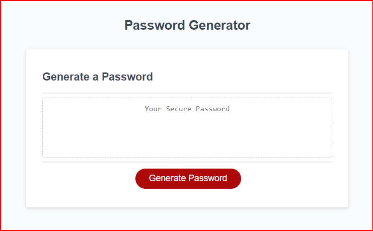

# Random Password Generator

## Table of Contents
* [Description](#description)
* [Installation](#installation)
* [Usage](#usage)
* [Add-On Tech Used](#add-on-tech-used)
* [License](#license)
* [Contributing](#contributing)
* [Tests](#tests)
* [Questions](#questions)
* [Screenshots](#screenshots)
* [Deployed URL](#deployed-url)
* [GitHub Repository](#github-repository)

## Description:

This is Module 3 HW assignment resubmittal for my Random password generator. This application will generate a random password based on user input. The user will be prompted to enter a password length between 8 and 128 characters. The user will then be prompted to select if they want to include lowercase, uppercase, numeric, and/or special characters. The application will then generate a random password based on the user's input. The password will be displayed on the page.

## Installation:

None

## Usage:

Visit deployed URL.

## Add-On Tech Used:

None

## License:

None

## Contributing:

Stater code provided by UCB Extension Coding Bootcamp.

## Tests:

None

## Questions:

If you have any questions, please contact me at coderchrisdean@gmail.com.

## Screenshot:

## Deployed URL:
<a href="https://coderchrisdean.github.io/random-pw-gen/">Link to Deployed Site</a>

## GitHub Repository:
<a href="https://coderchrisdean.github.io/random-pw-gen/">Link to GitHub Repo</a>